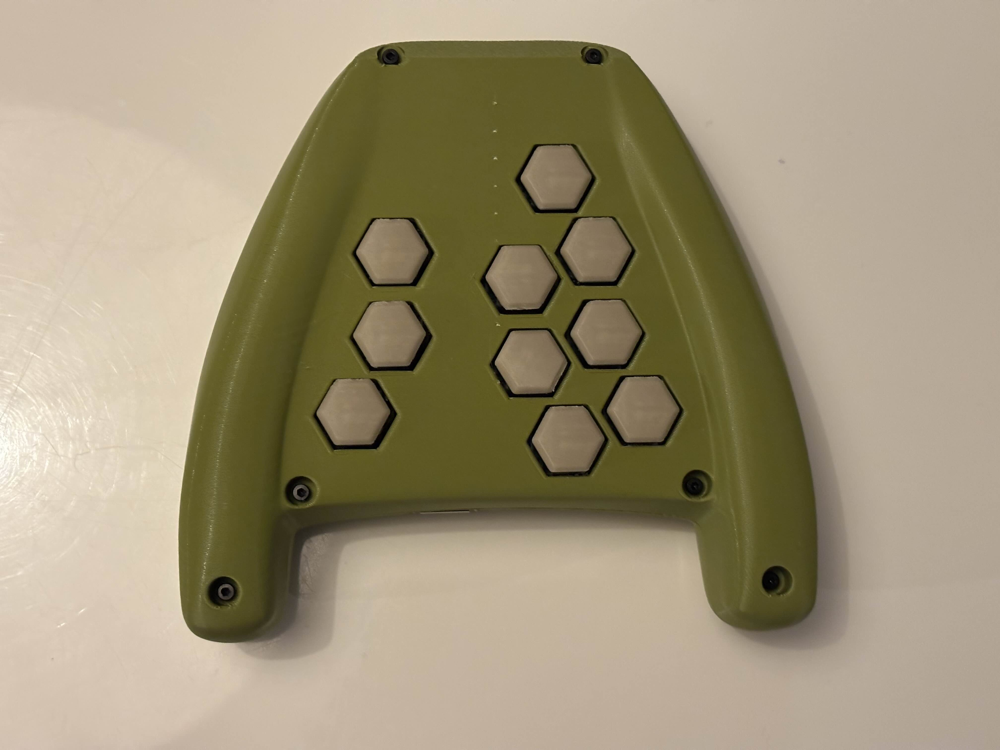
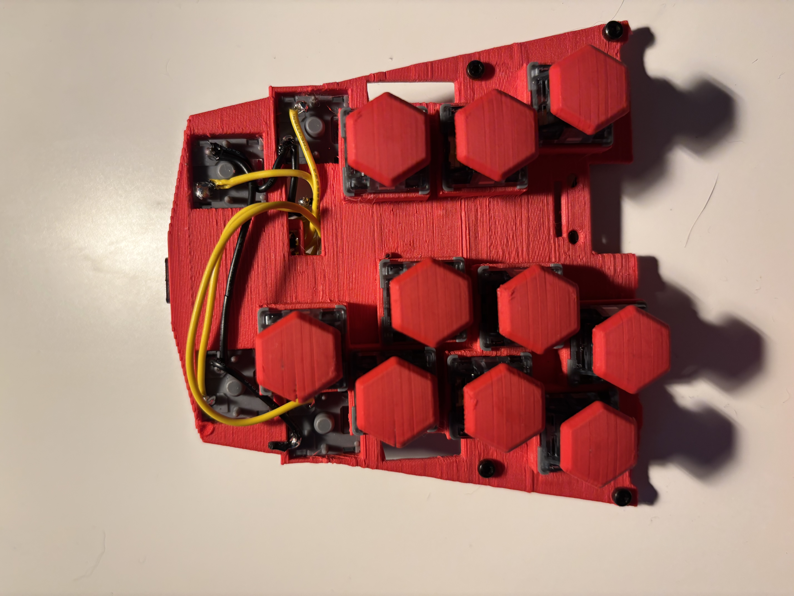

# Em Controller Version 2
This smaller Em controller, also affectionately nicknamed "Springspinne" (german for jumping spider), is a hand-held all-button game controller based on the [Em controller](../em-controller) with a focus on being more compact and easier to build. It's running the amazing [GP2040-CE](https://gp2040-ce.info/) firmware.

The idea is that most of the buttons are on the bottom side of the controller
and you can press them with your various fingers. The design aims to let you
use the same fingers for the same buttons you would use on more traditional
leverless controllers.

This time around there's also a "southpaw" version of the controller:

<!-- This is the button layout I am using: 

-->

## Why this form factor?
The idea is to have something more like a game pad and the ability to laze
around on the couch while also having the benefits of a leverless controller.
Like a flatbox without having to have the controller on the lap. While you
could just use a gamepad for this purpose, I have been unhappy with most, if
not all, dpads and wanted to be able to not miss the benefits of more detailed
control of directional input.

## How can I get my own?
The current version of this controller is handwired, so some soldering
equipment and skill is required. Currently, the shell and internals are 3D
printed. A PCB version of the right-handed variant is in the works.

There are a few variants to decide between when building your own controller.
First of all, there is the decision whether you want to build the left-handed (southpaw)
or right-handed (regular) version. For either, there are separate folders including
different print files.

Secondly, the shell files come either with or without prebuilt supports. The
prebuilt supports can help with preventing the controller from being printed
unevenly but aren't strictly needed and might also leave some marks on the
shell.

### What you'll need
- 1x printed top shell
- 1x printed bottom shell
- 14x printed button caps from `<layout-choice>/buttons/hex-buttons.stl`
- 3x printed menu buttons from `<layout-choice>/buttons/menu-button.stl`
- 1x printed switch support plate from `<layout-choice>/pcb-replacement/switch-support-plate.stl`
- 1x printed menu support plate from `<layout-choice>/pcb-replacement/menu-button-holder.stl`
- 1x printed waveshare holder from `<layout-choice>/pcb-replacement/board-holder.stl`
- 1x Waveshare RP2040-Zero (or equivalent)
- 14x Cherry MX-style full-sized keyboard switches (I have used Cherry MX Speed
  Silver and Akko V3 Silver Pro and I prefer the Akko ones)
- 4x Kailh Silent switch for mice (or similarly sized substitutions)
- 4x m2 heat set inserts (I use Ruthex)
- 1x female USB A breakout board. I got [these
  ones](https://www.amazon.de/Keenso-Breakout-Female-Adapter-Connector/dp/B07VBRTDVF) 
- 6x 16mm m2 screws
- 8x 6mm m2 screws
- 10x m2 nuts
- a bunch of wire to connect everything (I use AWG 26 stranded wire but other wire will work the same)

### Printing Notes

The shell halves are designed to be printed standing on their "noses", which is
why there is a flat plane on those noses. This is not the prettiest, but
a good trade-off to get a nice print. This way the controller can be printed at
a 45 degree angle, which should also work well with the hexagonal cutouts for
the buttons. The inside of the shells should be on the upside when printing to
avoid having to use a lot of supports for the different standoffs etc.

Print settings for the shells should be fine with mostly defaults. My
recommendation is to enable tree supports but only from the build plate to
prevent supports within the nut slots. Other than that you can change infill
settings however you like. Let me know if you encounter problems with printing
so I can make adjustments. I tested the print in PLA and PETG.

Fun fact: You can fit both shell halves on the build plate of Bambu Lab A1 mini.

Print the menu buttons on their flat side edge without supports.

I've had success with printing the hexagonal button caps on one of their edges
with normal supports enabled and two raft layers. This allows the convex shape to be printed
without problems.

The switch support plate has a chamfer on one edge that I recommend to use to
print on. Tree supports are required for this print.

I usually print the menu button holder face down with normal supports. This
will require removal of the supports with some tweezers or similar. 

The waveshare board holder arm can easily be printed without supports.

## Thank You

Big thanks to [Alpenmeister](https://alpenmeister.com/en) for being a constant sounding board on the design and especially for his work on the PCB.

Thank you to Giga on the GP2040-CE Discord for giving the design a spin and everyone else on the GP2040-CE Discord for advice and encouragement throughout development.

## Support
If you want to support this project you can [buy me
a coffee](https://ko-fi.com/merlindesigns).

## License
This project is published under [CC BY-NC-SA
4.0](https://creativecommons.org/licenses/by-nc-sa/4.0/). If you want to sell
this design, please contact me first.

If you have questions, you can find me (@Merlin) in the [Open Stick Community
Discord Server](https://discord.com/servers/openstickcommunity-1049366310389289001). 
